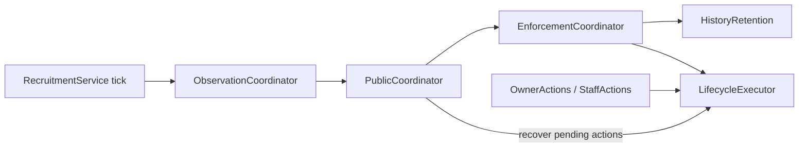

# Recruitment

| Mode | Behavior |
| --- | --- |
| Observe | Inventory listings and report facts, eligibility and evidence gaps to staff. |
| Advisory | Add Guidelines, public summaries and practice acknowledgement; allow confirmed owner close/remove. No automatic actions or acceptance. |
| Enforce | Accept eligible acknowledged listings and apply individually enabled action gates. |

Each author can maintain one Recruiting and one ForHire listing across paid/hobby forums.
Each group has its own 30-day creation/deletion cooldown; cross-group posting adds a
placement reminder. Payment and account/activity signals are advice, never automatic rejection.
Configured forums and their threads earn no XP even while recruitment is disabled; existing totals remain.

## Setup and Guidelines

See [deployment configuration and permissions](deployment.md#step-5-deploy-configmaps).
Checked-in deployments remain disabled. Configure all four forum slots and a staff-only
`Recruitment:FeedChannelId`; settings changes require a process restart.

The four Markdown files in `DiscordBot/Assets/recruitment/guidelines/` supply the native
forum Guidelines topic. `Recruitment:GuidelinesDirectory` is relative to `Storage:AssetsRootPath`.
Each file requires exactly one `UDC acknowledgement code: {{code}}` line. Other tokens are
`{{acknowledgement_minutes}}`, `{{cooldown_days}}` and `{{unanswered_days}}`.
Invalid tokens or rendered topics over 4096 characters fail validation.

Public modes initialize empty topics. Nonempty unmanaged topics and manually changed
owned topics require moderator/administrator adoption:

1. `/recruitment preview forum:<forum>` shows the proposed text and current fingerprints.
2. `/recruitment publish forum:<forum> expected-topic-hash:<fingerprint>` adopts it only if
   the topic still matches the preview. The preview's `ABCDE` is a placeholder code.
3. To repair a renamed saved Closed tag, also supply `repair-tag-hash:<tag fingerprint>`.

Preview works while stopped or degraded; publish needs Advisory/Enforce running. Avoid
simultaneous manual edits during publication: Discord writes are verified, not conditional.

The bot finds `Closed` by trimmed, case-insensitive name or appends an unmoderated tag.
Existing tags and `RequireTag` are preserved. Full inventories, conflicting matches and
renamed saved tags pause setup for staff repair. No tag or guidelines-post IDs need configuring.

Five-character codes rotate Monday at 00:00 UTC on the next healthy pass. Codes become
usable only after the written topic is verified. An open window accepts its issued code
and subsequent confirmed codes from that forum. Codes appear only in Guidelines.

## Owner controls and enforcement

The public message shows factual context, placement/payment advice, timestamps and controls.
Its optional 900×360 banner is an initial snapshot; essential information stays in live text
and attachment descriptions. Rendering/upload failures fall back to text.

- **Acknowledge guidelines:** private code form; five wrong answers cause a one-minute retry
  delay, not failure history. The full 30-minute window starts after usable delivery.
- **New acknowledgement window:** renew expired practice without penalty. Enrolled Enforce
  posts cannot self-renew while timeout enforcement is enabled.
- **Close listing:** available after practice acknowledgement or Enforce acceptance;
  requires a two-minute confirmation and locks/archives the listing.
- **Remove my post:** two-minute confirmation to permanently delete the thread and replies.

Controls verify the original guild/thread, owner, current generation and live protection.
Confirmations bind to the listing version and acceptance; stale/replayed submissions fail.
Closing preserves existing tags if Closed cannot fit. Archived listings remain discoverable
in older posts and search. Natural archive alone does not constitute policy closure.

Enforce saves a boundary on entry: earlier practice/imported attempts are not retroactively
punished. The boundary survives restart; re-entering Enforce creates a new boundary for
unaccepted posts. Staff can explicitly adopt or restart an earlier listing.

At the grace deadline, eligible acknowledged enrolled posts are accepted. Acceptance is
independent of these automatic-action gates; pending attempts reserve their group during evaluation.

| Gate | Action |
| --- | --- |
| `EnforceGuidelineTimeouts` | Delete an enrolled, unacknowledged attempt after its delivered window expires. |
| `EnforceListingLimits` | Lock/archive an acknowledged but ineligible attempt after its grace period. |
| `EnforceLifecycleClosures` | Lock/archive Closed withdrawals and accepted listings unanswered for 30 days. |

Automatic actions require current policy/protection evidence and a confirmed staff-feed
entry containing the saved intent. Timeout deletion also checks that Guidelines and the
owned prompt remain available. Unanswered closure requires complete response coverage
with no unresolved historical gap. Adding Closed withdraws an unaccepted attempt without
counting a timeout; Advisory does not automatically archive it.

A dispatched timeout counts only after confirmed deletion, atomically with completion.
Correct enforced acknowledgement resets the consecutive counter. The third and subsequent
consecutive timeouts add an alert to that attempt's staff entry; later resets retain the alert.
Disappearance before dispatch does not prove a bot-caused timeout.

## Moderator commands

All are `/recruitment` subcommands, restricted to the configured moderator role or
administrators in the configured guild. Thread arguments accept a full ID or channel mention.
Mutations record the actor and reason.

| Command | Purpose |
| --- | --- |
| `status` | Inspect saved lifecycle, eligibility, counters and holds, including while stopped. |
| `reconcile` | Refresh a thread and its staff entry. |
| `adopt` | In Enforce, accept reviewed history after capacity/cooldown checks. |
| `restart-acknowledgement` | Give an open, unaccepted listing a fresh window; enroll it in Enforce. |
| `exempt` | Add/remove automatic-action protection and cancel pending lifecycle work. |
| `waive-cooldown` | Waive current group anchors; future anchors and occupied capacity still apply. |
| `reset-timeouts` | Reset the consecutive counter, retaining audit history. |
| `review` | Resolve a finding and optionally attest historical response evidence. |
| `resolve-missing` | Record a verified UTC deletion time for a still-missing thread. |
| `close` / `reopen` | Change lifecycle. Reopen checks capacity, removes Closed and grants an exemption. |
| `remove` | Prepare a private, expiring deletion confirmation bound to the staff member and listing. |

Public mutations require Advisory/Enforce. Reconcile and metadata repair also work in
Observe and during recoverable public setup failures. No command clears a Discord pin.
After reopening, explicitly remove the exemption when normal policy should resume.

Review cannot erase known qualifying replies. An absence attestation clears uncertainty
only through the review instant; a fresh scan is still required before unanswered closure.
Restarting acknowledgement does not clear separate history holds.

## Recovery and retention

Restarts, gateway gaps and unavailable setup/delivery grant pending acknowledgements a
fresh full window after recovery. Deleted public messages are replaced. Archived, locked,
pinned and exempt posts are not automatically reopened or prompted.

Message sends and lifecycle actions save intent before Discord calls and verify outcomes
before recording completion. Interrupted sends search bot-owned footer markers before
retrying; do not edit/remove those markers. Qualifying replies remain evidence after
message deletion. Catch-up cannot prove that no reply was deleted during an outage.

State lives at `{ServerRootPath}/recruitment/recruitment-state.json`: SchemaVersion 1,
UTC timestamps, string IDs, one writer, no legacy upgrades. A first enabled start enrolls
missing, backup-free state and imports history as unverified. Corrupt/unsupported state,
a missing primary with a backup, or changed forum mappings require operator recovery.
Stop the bot, preserve the damaged file and restore a known-good snapshot; never delete
state to clear a fault. Writes retain the previous snapshot as `.json.bak`; the store's
explicit backup restore also preserves the replaced primary as `.json.replaced-*`.

Daily cleanup removes resolved terminal details after 12 calendar months and inactive
author aggregates after 24. Active listings, review holds, pending actions, recent moderation
and unfinished delivery retain dependencies. Accepted anchors are compacted first; ID-only
retirement markers prevent archive scans from recreating expired records. Retired threads
cannot be adopted/reopened through expired records. Discord content and XP are untouched.

## Maintainer map

Start at [RecruitmentService](../DiscordBot/Services/Recruitment/RecruitmentService.cs).
One work gate serializes its scheduler and command mutations. Stop cancels and drains both
before releasing the state writer. InteractionService dispatches commands and modals.



Folders under `DiscordBot/Services/Recruitment` match their namespaces:

| Folder | Responsibility |
| --- | --- |
| `Observation` | Inventory, reply evidence and staff-feed recovery. `IForumObserver` permits reads and staff-feed writes only. |
| `Publishing` | Guidelines/templates, public message delivery and the `IForumPublisher` Discord mutation boundary. |
| `Actions` | Owner/staff intent, automatic decisions and shared lifecycle execution. |
| `Policy` | Pure eligibility, response/content checks and forum classification (also used by XP). |
| `State` | Persisted models, validation, atomic store, history bookkeeping and retention. |
| `Presentation` | Staff/public text, banner rendering and offline preview. |

State callbacks change metadata only; keep Discord/database calls outside them. Policy
chooses an action, while `LifecycleExecutor` revalidates before dispatch and commits confirmed
outcomes. Presentation formats facts without changing policy. Preserve response uncertainty,
control versions and recovery markers when modifying these paths.

## Validation and deployment handoff

```sh
dotnet test DiscordBot.sln --configuration Release --no-restore
dotnet run --project DiscordBot -- --recruitment-preview /tmp/recruitment.png "$PWD/DiscordBot/Assets"
docker build --platform linux/amd64 -t udc-bot:recruitment-check .
```

The suite covers policy, delivery/replay recovery, moderation, retention and stop/restart.
Docker runs profile and recruitment native smoke checks. The operator owns deployment;
remaining live checks are:

- Stage Advisory setup/adoption, tag conflicts, desktop/mobile controls and text/image readability.
- Test Attach Files versus Send Messages in Threads loss, recovery windows and interrupted delivery/actions.
- Stage Enforce gates independently, including timeout counts, capacity, unanswered closure and Closed withdrawal.
- Verify moderator permissions, stale confirmations and component stop/restart during work.

Use disposable staging posts and accelerated test clocks; production defaults remain unchanged.
